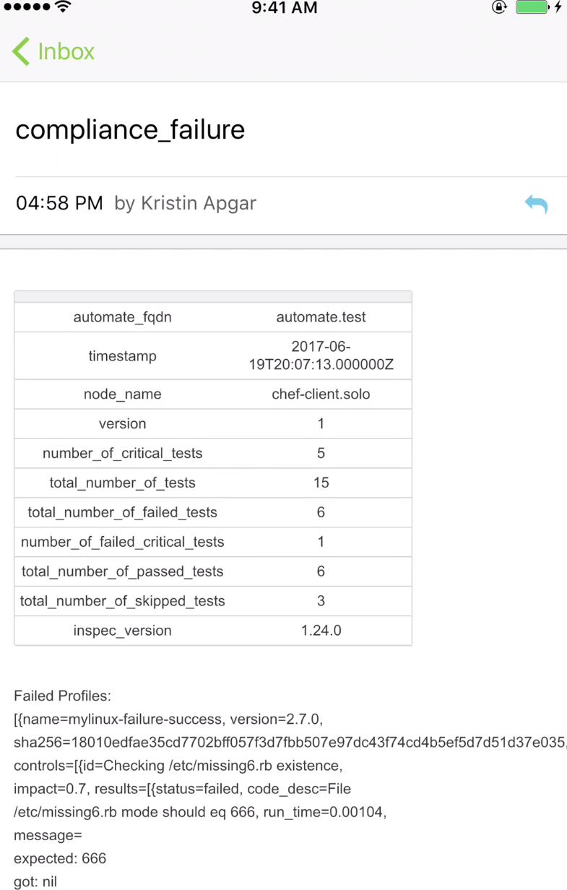

# Chef Automate Compliance Webhook
Whether you have five or five thousand servers, Chef lets you manage them all by turning infrastructure into code. Infrastructure described as code is flexible, versionable, human-readable, and testable. This specific integration provides details on integrating with Chef Automate.  A second set of instructions exists for automating with Chef Server (no Automate).

---------

<kbd>
  
</kbd>

---------


# Pre-Requisites
* Chef Automate v 3.x or higher.  The Compliance Webhook is new functionality.  See the following Chef documentation for instructions on how to configure the Notifier settings in the delivery.rb file of the Chef Automate server.  [delivery.rb Chef Help Docs](http://chef-web-docs-notify.s3-website-us-west-2.amazonaws.com/config_rb_delivery.html#notifier-settings)
* Chef Automate Compliance Webhook configured.  
* xMatters account - If you don't have one, [get one](https://www.xmatters.com)!
* xMatters ChefAutomateComplianceWebhook Communication Plan (see zip file in above files) imported into xMatters or created in xMatters.

# Files
* [Chef-Compliance-Webhook_IB.js](Chef-Generic-Webhook_IB.js) - The javascript file to be pasted into a Inbound Integration Builder. It takes the payload from Chef and formats the content to match the xMatters Form requirements and creates an xMatters Event. 
* [ChefAutomatecomplianceWebhook.zip](ChefAutomateGenericWebhook.zip) - The comm plan (if needed) that has all the cool scripts and email format and such. 

# Installation

## Chef Automate Server
1. Edit the delivery.rb file on the Chef Automate Server.  See the following instructions to configure the Notifier Settings. [delivery.rb](http://chef-web-docs-notify.s3-website-us-west-2.amazonaws.com/config_rb_delivery.html#notifier-settings).
2. The attached delivery.rb file is an example of the configured settings pointing to a xMatters instance.
3. The following are the ruby lines in the file:
      ``` 
      notifier['enable']
      notifier['compliance_user_webhook_url']
          
      ```
4. The following is a sample notification message body:

  ``` 
  {
  "automate_fqdn":"automate.test",
  "failure_snippet":"Chef Inspec found a critical control failure on [chef-client.solo](automate.test/viz/#/compliance)",
  "automate_failure_url":"automate.test/viz/#/compliance",
  "node_name":"chef-client.solo",
  "node_uuid":"aaaaaaaa-709a-475d-bef5-zzzzzzzzzzzz",
  "version":"1",
  "number_of_critical_tests":5,
  "total_number_of_tests":15,
  "total_number_of_failed_tests":6,
  "number_of_failed_critical_tests":1,
  "total_number_of_passed_tests":6,
  "total_number_of_skipped_tests":3,
  "inspec_version":"1.24.0",
  "failed_critical_profiles":[
     {
       "name":"mylinux-failure-success",
       "version":"2.7.0",
       "sha256":"18010edfae35cd7702bff057f3d7fbb507e97dc43f74cd4b5ef5d7d51d37e035",
       "controls":[
          {
            "id":"Checking /etc/missing6.rb existence",
            "impact":0.7,
            "results":[
               {
                 "status":"failed",
                 "code_desc":"File /etc/missing6.rb mode should eq 666",
                 "run_time":0.00104,
                 "message":"\nexpected: 666\n     got: nil\n\n(compared using ==)\n"
               }
            ],
            "status":"failed",
            "metadata":{
               "title":"Check /etc/missing6.rb",
               "desc":"File test in failure-success.rb",
               "impact":0.7,
               "refs":"[]",
               "tags":"{}",
               "code":"control 'Checking /etc/missing6.rb existence' do\n  impact 0.7\n  title \"Check /etc/missing6.rb\"\n  desc \"File test in failure-success.rb\"\n  describe file('/etc/missing6.rb') do\n    its('mode') { should eq 666 }\n  end\nend\n",
               "source_location":{
                  "ref":"/Users/lancefinfrock/workspace/automate/data_generator/chef-client/cache/cookbooks/test-cookbook/recipes/../files/default/compliance_profiles/mylinux-failure-success/controls/failure-success.rb",
                  "line":29
               },
               "id":"Checking /etc/missing6.rb existence"
            }
          }
       ],
       "metadata":{
          "type":"inspec_profile",
          "@version":"1",
          "@timestamp":"2017-06-19T20:07:13.860Z",
          "name":"mylinux-failure-success",
          "title":"Mylinux Failure Success",
          "maintainer":"Chef Software, Inc.",
          "copyright":"Chef Software, Inc.",
          "copyright_email":"support@chef.io",
          "license":"Apache 2 license",
          "summary":"Demonstrates the use of InSpec Compliance Profile",
          "version":"2.7.0",
          "supports":[
             {
               "os-family":"unix"
             }
          ],
          "attributes":[],
          "sha256":"18010edfae35cd7702bff057f3d7fbb507e97dc43f74cd4b5ef5d7d51d37e035",
          "doc_version":"1"
       }
     }
  ],
  "type":"compliance_failure",
  "end_time_utc":"2017-06-19T20:07:13.000000Z",
  "timestamp_utc":"2017-06-19T20:07:13.000000Z"
}
```
        
5. Restart the Chef Automate server after saving the delivery.rb file.


## xMatters set up
1. Import the Communication Plan (see files).  If this step is done you can skip steps 2.
2. Create (In|Out)bound integration and add the code from the Chef-Compliance-Webhook_IB.js file.
3. Configure the xMatters Endpoints. [xMatters Endpoints](https://help.xmatters.com/OnDemand/xmodwelcome/integrationbuilder/configure-endpoints.htm)
4. Create a chef group in xMatters and add your self to the group. [xMatters Groups](https://help.xmatters.com/OnDemand/groups/groups.htm).  The name of the chef group can be changed in the Inbound IB script.
  
# Testing
1. Run a Cookbook in Chef that will force the run to fail.
2. A message should come through on your devices.  Which ever devices you have configured in xMatters.
<kbd>

</kbd>
<kbd>

</kbd>
</kbd>
<kbd>

</kbd>

# Troubleshooting
View xMatters Activity Stream to determine issues with Chef payload or connectivity.


